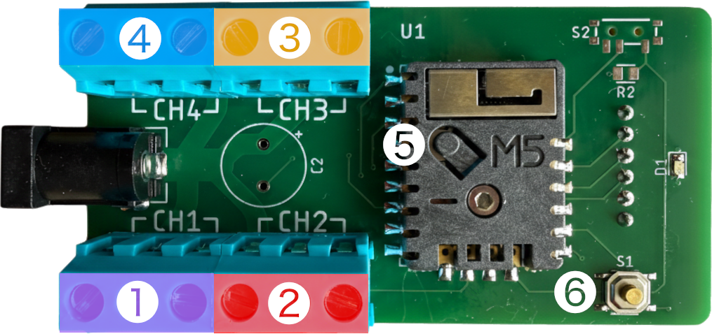
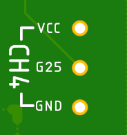

# Matchstick LED Controller

A 4-channel ambient LED controller based on the M5Stack Stamp Pico (ESP32). Drives up to 800 WS2812B LEDs across 4 independent channels, each with a fixed hue and 34 animation modes. Works out of the box with no phone or WiFi required — Apple HomeKit support is optional, for users who want per-channel color and brightness customization.

### Features

- 4 independent LED channels, 200 LEDs each (800 total WS2812B LEDs)
- Works standalone — no WiFi, no phone, no app required
- 4 fixed hues by default (one per channel), selectable from the color wheel
- 34 ambient animation modes with normal and inverted variants, cycling via onboard button
- **Optional:** pair with Apple Home for per-channel color, brightness, and on/off control
- Once configured via Apple Home, settings are saved to flash — WiFi not needed to operate
- Persistent settings across reboots (animation mode, hue, brightness)

---



|   | Component | Description |
|---|-----------|-------------|
| ⓵ | **CH1 — Sputter One** | Default hue: 270° (Purple/Magenta) |
| ⓶ | **CH2 — Sputter Two** | Default hue: 0° (Red) |
| ⓷ | **CH3 — Sputter Three** | Default hue: 90° (Yellow/Orange) |
| ⓸ | **CH4 — Sputter Four** | Default hue: 180° (Cyan) |
| ⓹ | **Reset button** | Quick press: force channels ON. Hold 3s: HSV reset. Hold 10s: WiFi AP mode. Hold 15s+: factory reset |
| ⓺ | **Animation button** | Short press: cycle animation mode. Long press (2s): toggle inverted variant |

---

## Hardware at a Glance

| Spec | Value |
|------|-------|
| Board | M5Stack Stamp Pico |
| MCU | ESP32-PICO-D4 |
| LED Channels | 4 × WS2812B, 200 LEDs each |
| Total LEDs | 800 |
| LED Protocol | Single-wire serial (RMT) |
| Power Required | 5V @ 3A |
| WiFi | 2.4GHz 802.11 b/g/n |
| HomeKit | Via HomeSpan (HAP protocol) |

See [`docs/HARDWARE.md`](docs/HARDWARE.md) for full wiring details and power calculations.

---

## Wiring

Connect a WS2812B LED strip to each channel's terminal connections — up to 4 strips total, 200 LEDs per channel.

Each channel has three terminals: **VCC**, **data** (GPIO pin), and **GND**.



| Terminal | Label | WS2812B wire |
|----------|-------|--------------|
| VCC | VCC | Red |
| Data | G26 / G18 / G19 / G25 | Green |
| GND | GND | White or Black |

> **Important:** Wire colours vary between manufacturers. Always check the datasheet or wiring diagram that came with your LED strip before connecting. Reversing VCC and GND, or connecting data to the wrong pin, can damage the strip or the controller.

---

## Quick Start

### Standalone Use (No Phone Required)

Power on the device — it starts immediately with 4 channels, each showing its default hue and animation. No setup needed.

- **Animation button ⓺:** short press to cycle through 34 animation modes
- **Long press (2s):** toggle between normal and inverted variants

That's it. The device runs indefinitely without WiFi or a phone.

### Optional: Apple HomeKit Setup

HomeKit lets you set custom colors, brightness, and on/off state per channel. Settings are saved to flash, so the device keeps them after you disconnect from WiFi.

#### Step 1 — Configure WiFi

1. **Hold** the reset button ⓹ for **10 seconds**
2. LEDs turn **solid purple** — release (before 15s) to enter AP mode
3. Connect your phone to WiFi network **"Matchstick-Setup"** (open, no password)
4. A captive portal opens — enter your home WiFi SSID and password
5. The device saves credentials and reconnects automatically

#### Step 2 — Pair with Apple Home

1. Open the **Apple Home** app on your iPhone or iPad
2. Tap **+** → **Add Accessory**
3. Scan the QR code below
4. If prompted about an "Uncertified Accessory", tap **Add Anyway**
5. The device appears as **"Matchstick 0x02"** — a bridge with 4 lights
6. Assign lights to rooms and tap **Done**

You will see 4 light accessories: **Sputter One**, **Sputter Two**, **Sputter Three**, **Sputter Four**.

Each channel can be independently controlled from Apple Home or Siri:

- **Power** — on/off per channel
- **Brightness** — 0–100% (also affects animation density in some modes)
- **Color** — full hue/saturation control
- **Siri** — "Hey Siri, turn on Sputter One" / "Set Sputter Two to blue"

Once you've dialed in your colors and brightness, the device no longer needs WiFi — it runs from flash-saved settings.

#### Pairing QR Code


> **QR code not working?** Try a [factory reset](#factory-reset) first to clear any previous pairings. If it still doesn't work, your device may be running a different firmware version — **[use the interactive decoder →](https://outofjungle.github.io/homekit-matchstick-sputter/)** to identify your version and find the matching QR code.

---

## Controls

### Animation Button ⓺ (GPIO0)

| Press | Action |
|-------|--------|
| **Short press** | Cycle to next animation mode |
| **Long press (2s)** | Toggle between normal and inverted variants of the current mode |

Inverted modes use a dark sparkle base (most LEDs black) instead of the bright base layer. Animation mode is saved to flash and restored on reboot.

### Reset Button ⓹ (GPIO39)

| Hold Duration | Action |
|---------------|--------|
| Quick press (<3s) | Force all channels power ON, stop animations |
| 3 seconds (while held) | Reset all channels to default colors immediately |
| Release 3–10s | Idle — HSV reset already applied |
| 10 seconds | LEDs turn solid purple; release to enter WiFi AP mode |
| 15+ seconds | Pairing code display begins — factory reset warning (see [Factory Reset](#factory-reset)) |

---

## Animation Modes

Short-press the animation button ⓺ to advance. Long-press (2s) to toggle the inverted variant of the current mode.

### HomeKit Mode

| # | Mode | Description |
|---|------|-------------|
| 0 | **HomeKit** | Normal HomeKit-controlled operation. No animation. |

### Inverted Animations (dark sparkle base)

Dark background: 40 of 200 LEDs glow at any moment, each fading in and out with a smooth sine hump (~2–6s per pulse).

| # | Mode | Description |
|---|------|-------------|
| 1 | **Inverted Base** | Pure dark sparkle — no overlay |
| 2 | **Inv. Monochromatic Runner** | Single-color moving blob on dark sparkle |
| 3 | **Inv. Monochromatic Rain** | Single-color fade-in-place bloom on dark sparkle |
| 4 | **Inv. Monochromatic Twinkle** | Single-color twinkle cycle on dark sparkle |
| 5 | **Inv. Complementary Runner** | 2-color (opposite hues) runner on dark sparkle |
| 6 | **Inv. Complementary Rain** | 2-color rain on dark sparkle |
| 7 | **Inv. Complementary Twinkle** | 2-color twinkle on dark sparkle |
| 8 | **Inv. Split-Comp Runner** | 3-color split-complementary runner on dark sparkle |
| 9 | **Inv. Split-Comp Rain** | 3-color split-complementary rain on dark sparkle |
| 10 | **Inv. Split-Comp Twinkle** | 3-color split-complementary twinkle on dark sparkle |
| 11 | **Inv. Triadic Runner** | 3-color triadic runner on dark sparkle |
| 12 | **Inv. Triadic Rain** | 3-color triadic rain on dark sparkle |
| 13 | **Inv. Triadic Twinkle** | 3-color triadic twinkle on dark sparkle |
| 14 | **Inv. Square Runner** | 4-color square runner on dark sparkle |
| 15 | **Inv. Square Rain** | 4-color square rain on dark sparkle |
| 16 | **Inv. Square Twinkle** | 4-color square twinkle on dark sparkle |

### Normal Animations (bright Markov base)

Bright, undulating base layer where all 200 LEDs glow continuously.

| # | Mode | Description |
|---|------|-------------|
| 17 | **Base** | Markov base layer only — gentle color undulation |
| 18 | **Monochromatic Runner** | Single-color moving Gaussian blob |
| 19 | **Monochromatic Rain** | Single-color fade-in-place bloom |
| 20 | **Monochromatic Twinkle** | Single-color twinkle cycle |
| 21 | **Complementary Runner** | 2-color (opposite hues) runner |
| 22 | **Complementary Rain** | 2-color rain |
| 23 | **Complementary Twinkle** | 2-color twinkle |
| 24 | **Split-Comp Runner** | 3-color split-complementary runner |
| 25 | **Split-Comp Rain** | 3-color split-complementary rain |
| 26 | **Split-Comp Twinkle** | 3-color split-complementary twinkle |
| 27 | **Triadic Runner** | 3-color triadic (120° spacing) runner |
| 28 | **Triadic Rain** | 3-color triadic rain |
| 29 | **Triadic Twinkle** | 3-color triadic twinkle |
| 30 | **Square Runner** | 4-color square (90° spacing) runner |
| 31 | **Square Rain** | 4-color square rain |
| 32 | **Square Twinkle** | 4-color square twinkle |

### Rainbow

| # | Mode | Description |
|---|------|-------------|
| 33 | **Rainbow** | Full-spectrum rainbow sweep across all channels |

### Color Harmony Reference

| Harmony | Colors | Hue Offsets | Character |
|---------|--------|-------------|-----------|
| Monochromatic | 1 | {0°} | Single hue, brightness/sat variations |
| Complementary | 2 | {0°, 180°} | High contrast opposite colors |
| Split-Complementary | 3 | {0°, 150°, 210°} | Primary + two flanking the complement |
| Triadic | 3 | {0°, 120°, 240°} | Three evenly spaced colors |
| Square | 4 | {0°, 90°, 180°, 270°} | Four evenly spaced colors |

---

## Factory Reset

A full factory reset clears all HomeKit pairings, WiFi credentials, saved animation mode, and channel defaults.

1. **Hold** the reset button ⓹ (GPIO39)
2. At **3 seconds** — all channels reset to default colors. Keep holding.
3. At **10 seconds** — LEDs turn solid purple. Keep holding.
4. At **15 seconds** — pairing code display begins (10 seconds): 8 LEDs show your pairing config ID in binary
5. **Keep holding** through the entire display
6. When the display ends, **factory reset executes** — red LEDs for 3s, then device reboots fresh

To cancel: release the button at any point during the pairing code display. LEDs turn **solid green** for 3 seconds to confirm, then resume normal operation.

---

## Identifying Your Release

Each verified firmware build has a `PAIRING_CONFIG_ID` and a corresponding git tag. Use the decoder app to read your device's current pairing config ID from the LEDs.

During the factory reset warning animation, the first 8 LEDs display `PAIRING_CONFIG_ID` in binary:
- **Red LED** = bit 1
- **Blue LED** = bit 0
- LED 1 = MSB (bit 7), LED 8 = LSB (bit 0)

**[Use the interactive decoder →](https://outofjungle.github.io/homekit-matchstick-sputter/)**
_(or open `docs/index.html` locally)_

Each release tag also tracks the exact pairing QR code used at that build:

```
https://github.com/outofjungle/homekit-matchstick-sputter/blob/release-0x08/docs/img/pairing_qr.png
```

Replace `release-0x08` with the tag for the release you're looking up.

---

## Troubleshooting

| Problem | Solution |
|---------|----------|
| **QR code not working** | Do a [factory reset](#factory-reset) first to clear previous pairings, then try scanning again. If it still fails, your device may be on a different firmware version — [use the interactive decoder](https://outofjungle.github.io/homekit-matchstick-sputter/) to find the right QR code. |
| **WiFi not connecting** | Re-enter AP mode: hold the reset button for 10 seconds until LEDs turn purple, then release. Reconnect to "Matchstick-Setup" and re-enter credentials. |
| **Device not responding** | Try a [factory reset](#factory-reset) to restore the device to a clean state. |

See [`docs/HOMESPAN.md`](docs/HOMESPAN.md) for additional HomeSpan-specific troubleshooting and serial commands.

---

## Developer Documentation

| Document | Contents |
|----------|----------|
| [`docs/HARDWARE.md`](docs/HARDWARE.md) | GPIO pin mapping, wiring diagram, power requirements |
| [`docs/M5STAMP-PICO.md`](docs/M5STAMP-PICO.md) | M5Stack Stamp Pico hardware reference |
| [`docs/HOMESPAN.md`](docs/HOMESPAN.md) | HomeSpan setup, WiFi config, serial commands, troubleshooting |
| [`docs/BUILD_SETUP.md`](docs/BUILD_SETUP.md) | Build environment setup (PlatformIO) |
| [`docs/BASE_LAYER_ANIMATION.md`](docs/BASE_LAYER_ANIMATION.md) | Markov chain base layer algorithm |
| [`docs/INVERTED_BASE_ANIMATION.md`](docs/INVERTED_BASE_ANIMATION.md) | SparkleBaseLayer (dark field) algorithm |
| [`docs/COLOR_HARMONIES.md`](docs/COLOR_HARMONIES.md) | Animation class hierarchy and color harmony system |
| [`docs/RAIN_ANIMATION.md`](docs/RAIN_ANIMATION.md) | Rain animation algorithm |
| [`docs/TWINKLE_ANIMATION.md`](docs/TWINKLE_ANIMATION.md) | Twinkle animation algorithm and timing |
| [`docs/GAUSSIAN_BLENDING.md`](docs/GAUSSIAN_BLENDING.md) | Gaussian blend math used by Runner/Rain |
